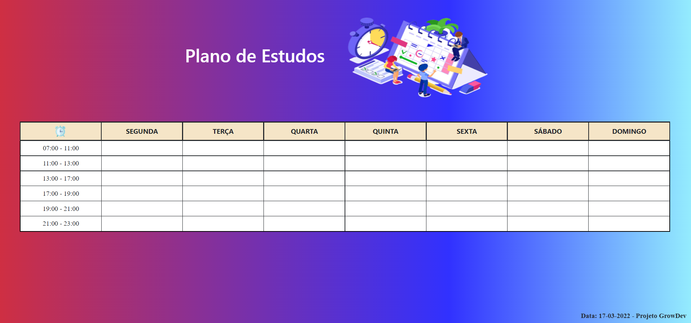

<h1 align="center">Table</h1>

Atividade avaliativa do projeto da GrowDev - <b>Starter Full Stack Web Developer</b>

Projeto criado com o objetivo de fortalecer os conhecimentos em tabelas no HTML e de publicações no Github.
Neste projeto foi criado uma tabela simples e utilizado conhecimentos de estilo e marcações.

O resultado pode ser visto na figura abaixo:

